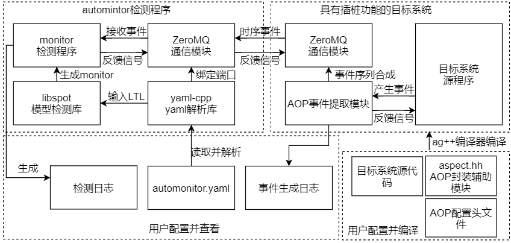

## 原理
Monitor自动机是一种特殊类型的buchi自动机,可以表示运行时系统的行为,故可用来监控运行时系统。      
AutoMonitor运用了spot库中Monitor生成算法，将buchi自动机转化为能够接受一连串有限字的Monitor自动机，并增加了字检测功能，从而可以监控运行时系统。      
Automonitor也支持生成solidity监控器用于监控以太坊合约。
## 架构


## 从本地安装spot库
本软件自带了spot 2.8,进入lib/libspot下, 
```
./configure
make 
sudo make install
```
或者也可以从以下网址下载spot2.8.x
```
https://spot.lrde.epita.fr/
```
## debian或Fedra 在线安装spot库
`https://spot.lrde.epita.fr/install.html`
## 编译本项目
进入src目录     
`g++ -std=c++14 -I/usr/local/include automonitor.cc -L/usr/local/lib -lspot -lbddx -o automonitor`         
编译出现错误，往往是include 文件夹里缺少spot的头文件，或者说lib文件夹里缺少 libspot相关的文件。
### 加入gdb调试
`g++ -g -std=c++14 -I/usr/local/include automonitor.cc -L/usr/local/lib -lspot -lbddx -o automonitor` 

### 用命令行创建确定性Monitor自动机并保存为hoa格式
`ltl2tgba -D -M 'G(!red | X!yellow)'` 
### 把自动机输出为pdf格式
`ltl2tgba -D -M 'G(!red | X!yellow)' -d | dot -Tpdf > demo1.pdf`

## 注意事项
编译时,g++版本要5.0以后。

## 安装AspectC++

## 安装配置
### 安装zeromq
ubuntu下    
`apt install libzmq3-dev`
### 安装yaml-cpp
`https://github.com/jbeder/yaml-cpp/`
### 安装graphviz-dev
`apt install libgraphviz-dev`
### 安装libjsoncpp-dev

## 相关链接
### CMU的模型检测库
`https://www.cs.cmu.edu/~modelcheck/index.html`

## 核心算法设计
第一步是去掉括号。
函数 Parse_label_exp_to_RPN的作用是解析复杂格式的被检测字，
例如 (a | b) & (b | c),该表达式较为复杂，具有括号和逻辑运算符。
因此要将其解析为某种数据结构，使得可以和外界输入进来的字进行匹配。
借鉴逆波兰算法，用栈的方式将表达式中的字符输入。去掉括号。
该函数去掉括号后得到的数组

函数Parse_label_RPN_to_string_sets作用是将去除括号得到的PRN字符串数组进一步解析为只包含&关系的字符串数组。
